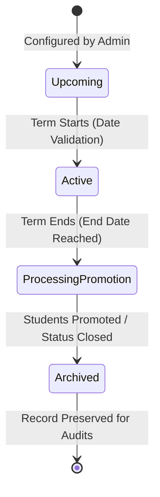

# Semester Module Design

## 1. Purpose
The **Semester Module** manages the temporal partition of academic cohorts within the system. It tracks academic term durations, manages term statuses (Active, Archived, Upcoming), and governs student promotions between terms.

---

## 2. Overview
Semesters divide the academic year into periods of instruction (e.g., Fall 2026, Spring 2027). Tracking semester bounds is essential for identifying active courses and subjects and verifying student attendance eligibility during a given date range.

### Table Schema Expansion Plans
The `semesters` configuration is defined with the following structural layout:

| Column Name | Type | Constraints | Description & Justification |
| :--- | :--- | :--- | :--- |
| `id` | INTEGER | PK, Auto-increment | Primary key. |
| `name` | VARCHAR(50) | NOT NULL | Desired term name (e.g., "Fall Semester 2026"). |
| `academic_year` | VARCHAR(9) | NOT NULL | School year format (e.g., "2026-2027"). |
| `start_date` | DATE | NOT NULL | Official beginning date. Face recognition attendance triggers within this window. |
| `end_date` | DATE | NOT NULL | Official term completion date. |
| `status` | VARCHAR(15) | DEFAULT 'Upcoming' | Current active status: 'Upcoming', 'Active', 'Archived'. |

---

## 3. Responsibilities
- **Temporal Access Control**: Prevent users from logging attendance outside of the active start and end dates.
- **Active Term Tracking**: Provide helpers that identify the current semester, simplifying dashboard queries.
- **Promotion & Transition Control**: Coordinate the promotion of student groups from their current semester index (e.g., Sem 3) to the next (e.g., Sem 4) at term end.

---

## 4. Workflow
The transition from an active semester to a new term follows this sequential workflow:

### Promotion Workflow Details:
1. **Term Close**: When the `end_date` is reached, the administrator initiates the term-closing procedure.
2. **Evaluation & Verification**: Verify that attendance registers are finalized and marked.
3. **Promotion Selection**: Select eligible students and run the promotion service (e.g., setting the student's `semester_id` to the next consecutive term ID).
4. **Archive state**: Mark the current semester status as `Archived`, and set the next configured term's status to `Active`.

---

## 5. Business Rules
- **Active Term Lock**: Only one semester record can be flagged as `Active` at any given time per program.
- **Chronological Consistency**: The `start_date` must precede the `end_date` by at least 60 days (to prevent micro-semesters) and cannot overlap with other terms in the same program.
- **Promotion Prerequisites**: Students cannot be promoted if their profile is flagged as `Suspended` or `Inactive`.

---

## 6. Design Decisions
- **Archival Design (Immutability of Logs)**: When a semester is marked as `Archived`, all linked attendance logs are set to read-only. This prevents retroactive changes to historical grades and verification logs.
- **Dynamic Date Evaluation**: The application layer validates dates against the active term's bounds during attendance capture, rather than hardcoding active date limits in the database.

---

## 7. Future Improvements
- **Automatic Term Shifting**: Build background timers that auto-promote semesters from `Upcoming` to `Active` on the designated start date.
- **Mid-term Enrollment Suspension**: Block late registration flags if a student is registered more than 30 days after the semester's start date.

---

## 8. References to Related Modules
- [Management Overview](file:///c:/GitHub/Attendence-System-Uning-Face-Recognition/docs/management/Management_Overview.md)
- [Course Module](file:///c:/GitHub/Attendence-System-Uning-Face-Recognition/docs/management/Course_Module.md)
- [Enrollment Module](file:///c:/GitHub/Attendence-System-Uning-Face-Recognition/docs/management/Enrollment.md)
- [Business Rules](file:///c:/GitHub/Attendence-System-Uning-Face-Recognition/docs/management/Business_Rules.md)
