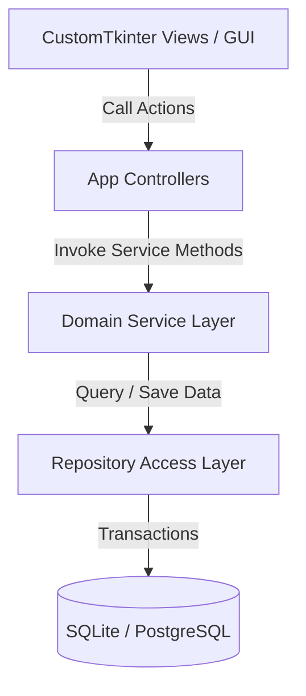
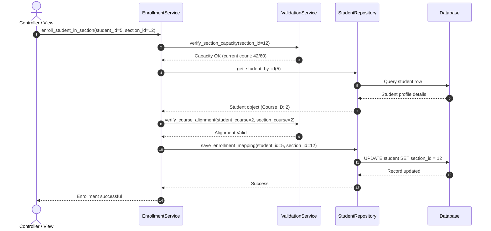

# Service Architecture

## 1. Purpose
The **Service Architecture** defines the structural layer between the GUI controllers and the data access repositories. It outlines service interfaces, inputs, outputs, and validation steps to ensure the application remains modular, maintainable, and testable.

---

## 2. Overview
The service layer isolates all business logic from GUI widgets (CustomTkinter) and raw database transactions. Each domain area has a dedicated service class that coordinates transactions, runs validation checks, and logs events.

### Service Layer Boundaries

---

## 3. Service Layer Specifications

### 3.1 Student Service (`StudentService`)
- **Responsibilities**: Manage student registrations, profile updates, and active/inactive status transitions.
- **Key Methods**:
  - `register_student(payload: StudentRegisterDTO) -> StudentResponseDTO`
  - `update_profile(student_id: int, payload: StudentUpdateDTO) -> StudentResponseDTO`
  - `deactivate_student(student_id: int, reason: str) -> bool`
  - `update_face_status(student_id: int, status: str) -> bool`
- **Exceptions Raised**: `ValidationError`, `DuplicateRecordException`, `StudentNotFoundException`.

### 3.2 Faculty Service (`FacultyService`)
- **Responsibilities**: Manage faculty onboarding, department links, and subject assignments.
- **Key Methods**:
  - `register_faculty(payload: FacultyRegisterDTO) -> FacultyResponseDTO`
  - `assign_subject(faculty_id: int, subject_id: int) -> bool`
  - `update_employment_status(faculty_id: int, status: str) -> bool`
- **Exceptions Raised**: `FacultyNotFoundException`, `SubjectNotFoundException`, `ScheduleConflictException`.

### 3.3 Department & Course Service (`DepartmentService`)
- **Responsibilities**: Manage departments, programs, courses, and subject structures.
- **Key Methods**:
  - `create_department(name: str, code: str) -> DepartmentDTO`
  - `create_course(name: str, code: str, department_id: int) -> CourseDTO`
  - `add_subject(course_id: int, name: str, code: str, credits: int) -> SubjectDTO`

### 3.4 Enrollment Service (`EnrollmentService`)
- **Responsibilities**: Manage student enrollments, sections, and promotions.
- **Key Methods**:
  - `enroll_student_in_section(student_id: int, section_id: int) -> bool`
  - `transfer_student(student_id: int, target_section_id: int) -> bool`
  - `promote_students(source_section_id: int, target_semester_id: int) -> PromotionSummaryDTO`

### 3.5 Validation Service (`ValidationService`)
- **Responsibilities**: Validate formatting, check regex rules, and enforce academic constraints.
- **Key Methods**:
  - `validate_email(email: str) -> bool`
  - `validate_phone(phone: str) -> bool`
  - `validate_student_code(code: str) -> bool`
  - `verify_section_capacity(section_id: int) -> bool`

### 3.6 Import Service (`ImportService`)
- **Responsibilities**: Parse and import student and faculty records from CSV and Excel templates.
- **Key Methods**:
  - `import_students_from_csv(file_path: str) -> ImportResultDTO`
  - `import_faculty_from_excel(file_path: str) -> ImportResultDTO`

### 3.7 Export Service (`ExportService`)
- **Responsibilities**: Generate and download reports in CSV, PDF, or Excel formats.
- **Key Methods**:
  - `export_student_list(filters: StudentFilterDTO, format: str) -> str` (Returns generated file path)
  - `export_attendance_report(subject_id: int, date_range: Tuple[date, date], format: str) -> str`

### 3.8 Search Service (`SearchService`)
- **Responsibilities**: Run dynamic, paginated queries across student and faculty records.
- **Key Methods**:
  - `search_students(query: str, filters: StudentFilterDTO, page: int, limit: int) -> PaginatedStudentsDTO`
  - `search_faculty(query: str, filters: FacultyFilterDTO, page: int, limit: int) -> PaginatedFacultyDTO`

### 3.9 Notification Service (`NotificationService` - Future)
- **Responsibilities**: Send email and SMS alerts for attendance exceptions or registration events.
- **Key Methods**:
  - `send_attendance_alert(student_id: int, attendance_record_id: int) -> bool`
  - `send_registration_confirmation(user_id: int) -> bool`

---

## 4. Workflow
The workflow below details how services interact during student enrollment:

---

## 5. Business Rules
- **DTO Isolation**: Services must receive and return Data Transfer Objects (DTOs) rather than raw SQLAlchemy model objects. This practice keeps database transactions isolated within the repository layer.
- **Service Dependency Injection**: Services are initialized using dependency injection (passing database sessions and repository instances to constructors). This approach makes it easy to mock dependencies during unit testing.

---

## 6. Design Decisions
- **Data Transfer Objects (DTOs)**: Using DTOs (e.g., Python dataclasses or Pydantic models) to transfer data between layers prevents GUI views from editing database objects directly.
- **Service-Level Validation**: Running validation checks in the service layer rather than in database models keeps the validation logic centralized, readable, and easy to test.

---

## 7. Future Improvements
- **Asynchronous Task Queuing**: Implement task queues (e.g., Celery) to run long-running service tasks, such as bulk email notifications or file exports, in the background.
- **REST Controller Mapping**: Design lightweight wrapper classes that expose these service methods as REST API endpoints (using frameworks like FastAPI or Flask).

---

## 8. References to Related Modules
- [Management Overview](file:///c:/GitHub/Attendence-System-Uning-Face-Recognition/docs/management/Management_Overview.md)
- [Data Validation](file:///c:/GitHub/Attendence-System-Uning-Face-Recognition/docs/management/Data_Validation.md)
- [Import & Export](file:///c:/GitHub/Attendence-System-Uning-Face-Recognition/docs/management/Import_Export.md)
