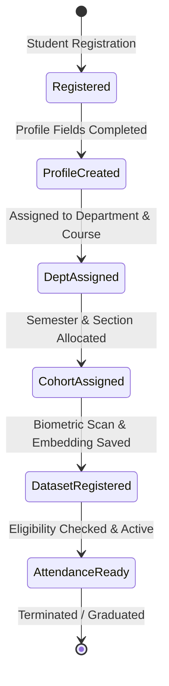

# Student Module Design

## 1. Purpose
The **Student Module** manages the complete lifecycle of students within the Face Recognition Attendance System. It provides the structured record format (Student Profile) and transition logic required to turn raw student candidates into biometrically verified, attendance-ready individuals.

---

## 2. Overview
The Student Module handles registration, profile configuration, and status tracking. A student moves from onboarding to profile setup, then to academic structural assignments (department, course, semester, section), before registering their face dataset for active attendance tracking.

### Student Profile Field Design
Below are the proposed fields for the expanded `students` profile. These columns map to the database layer as either additions to the `students` table or as a closely coupled `student_profiles` table.

| Field Name | Type | Constraints | Description & Justification |
| :--- | :--- | :--- | :--- |
| `id` | INTEGER | PK, Auto-increment | Unique internal surrogate key for relational mapping. |
| `student_code` | VARCHAR(50) | UNIQUE, NOT NULL | Institution-wide registration number. Serves as a human-readable identifier and login check. |
| `roll_number` | VARCHAR(50) | UNIQUE, NULLABLE | Classroom/Examination-specific identifier. Set during section assignment. |
| `first_name` | VARCHAR(50) | NOT NULL | Student's given name. |
| `last_name` | VARCHAR(50) | NOT NULL | Student's family name. |
| `email` | VARCHAR(100) | UNIQUE, NOT NULL | Institutional communication email. Used for alerts and notifications. |
| `phone` | VARCHAR(20) | NOT NULL | Student contact phone number. |
| `department_id` | INTEGER | FK -> `departments(id)` | Bridges the student to their parent academic department. |
| `course_id` | INTEGER | FK -> `courses(id)` | Maps the student to a specific degree plan (e.g., B.Tech CSE). |
| `semester_id` | INTEGER | FK -> `semesters(id)` | Represents the student's current academic level. |
| `section_id` | INTEGER | FK -> `sections(id)` | Represents the classroom cohort they belong to. |
| `batch` | VARCHAR(10) | NOT NULL | Graduation batch year (e.g., "2024-2028") to segment cohorts. |
| `gender` | VARCHAR(10) | NOT NULL | Required for statistical reports and profiling. |
| `date_of_birth` | DATE | NOT NULL | Age verification and verification checks. |
| `photo_reference` | VARCHAR(255) | NULLABLE | Filepath to primary profile thumbnail image. |
| `face_dataset_status` | VARCHAR(20) | DEFAULT 'Unregistered' | Status of facial recognition scans: 'Unregistered', 'Registered', 'Failed'. |
| `enrollment_status` | VARCHAR(20) | DEFAULT 'Pending' | Student status: 'Pending', 'Active', 'Suspended', 'Graduated', 'Withdrawn'. |
| `guardian_name` | VARCHAR(100) | NOT NULL | Name of parent or guardian. |
| `guardian_phone` | VARCHAR(20) | NOT NULL | Contact number for parent or guardian. |
| `emergency_contact_name` | VARCHAR(100) | NOT NULL | Primary contact person during emergencies. |
| `emergency_contact_phone` | VARCHAR(20) | NOT NULL | Telephone number for emergencies. |
| `is_active` | BOOLEAN | DEFAULT TRUE | Global boolean filter to soft-delete or deactivate students. |

---

## 3. Responsibilities
- **Lifecycle Progression Management**: Update student stages cleanly based on academic actions (enrollment, semester promotion, suspension, graduation).
- **Profile Integrity Verification**: Validate inputs against academic constraints (e.g., ensuring a student's course belongs to their selected department).
- **Biometric Synchronization Triggering**: Interface with the Face Recognition module by updating `face_dataset_status` when facial training templates are added or deleted.

---

## 4. Workflow
The student lifecycle moves through several phases before they are cleared for biometric attendance tracking:

### Process Steps:
1. **Student Registration**: System administrator enters basic information (name, email, code) to create the shell user record.
2. **Profile Creation**: Guardian and demographic details are saved.
3. **Department/Course Assignment**: Student is matched with their target academic discipline.
4. **Semester/Section Assignment**: The student is placed in a classroom group.
5. **Face Dataset Registration**: The camera module captures facial images, extracts 512-dimensional embeddings, and saves them.
6. **Attendance Ready**: The system flags the student as eligible, allowing face scans to mark them present.

---

## 5. Business Rules
- **Biometric Prerequisite**: A student's `enrollment_status` cannot transition to `Active` unless `face_dataset_status` is marked as `Registered`.
- **Identifier Uniqueness**: The combination of `student_code` and `roll_number` must be unique across the active database to prevent collision.
- **Parental Records**: A student record cannot be marked as "Active" if emergency contact details are missing.

---

## 6. Design Decisions
- **Normalization of Profile Data**: Kept the profile data in the main `students` table to avoid multi-table joins for simple GUI listings.
- **Enum for Status Fields**: The `enrollment_status` and `face_dataset_status` columns will be validated against strict business-level string constants in Python services to ensure SQLite compatibility without relying on native DB-specific Enums.
- **Emergency and Guardian Division**: Kept guardian details separate from emergency contacts, as guardians may reside in different locations, and emergency contacts require instant accessibility.

---

## 7. Future Improvements
- **Self-Service Portals**: Allow students to log in and upload profile pictures, updating `photo_reference` for administrative review.
- **Biometric Recalibration Log**: Save a historical log of when a student's face dataset was updated to track face aging adjustments.

---

## 8. References to Related Modules
- [Management Overview](file:///c:/GitHub/Attendence-System-Uning-Face-Recognition/docs/management/Management_Overview.md)
- [Department Module](file:///c:/GitHub/Attendence-System-Uning-Face-Recognition/docs/management/Department_Module.md)
- [Course Module](file:///c:/GitHub/Attendence-System-Uning-Face-Recognition/docs/management/Course_Module.md)
- [Enrollment Module](file:///c:/GitHub/Attendence-System-Uning-Face-Recognition/docs/management/Enrollment.md)
- [Data Validation](file:///c:/GitHub/Attendence-System-Uning-Face-Recognition/docs/management/Data_Validation.md)
