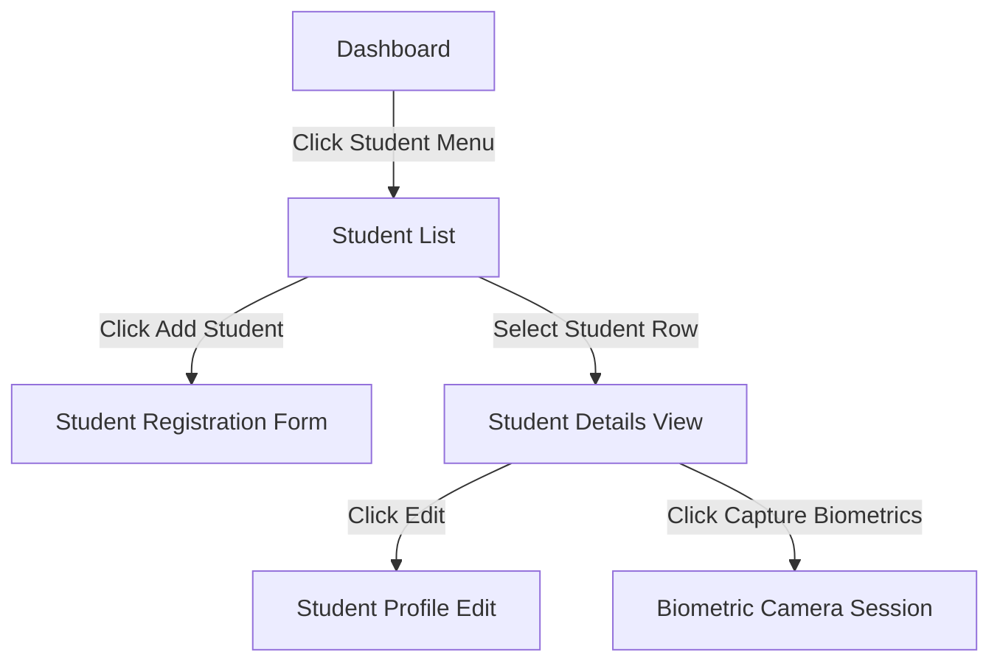

# UI/UX Planning

## 1. Purpose
The **UI/UX Planning** document designs the user interfaces for the Face Recognition Attendance System. It provides layout guides, widget lists, and interaction patterns to ensure a professional and accessible experience for administrators, faculty, and students.

---

## 2. Overview
The user interface is designed using **CustomTkinter** for local desktop clients during development, with layouts that can scale to modern web frameworks (e.g., React, HTML5/CSS3) for production. The design uses a clean, dark-mode-first aesthetic with a sidebar navigation layout.

### Application Layout Guide
```
+------------------------------------------------------------------------------------+
|  Logo & System Header | Current User: Dr. Debajyoti (HOD)      | Active Term: Fall |
+------------------------------------------------------------------------------------+
|  [Sidebar Navigation] |  [Main Content Workspace Area]                             |
|  - Dashboard          |                                                            |
|  - Students           |  * Displays the target view screen (e.g. Student List)     |
|  - Faculty            |  * Contains search bars, action buttons, data grids        |
|  - Classes & Schedules|  * Includes paginated navigation controls at the bottom    |
|  - Bulk Operations    |                                                            |
|  - Settings           |                                                            |
+------------------------------------------------------------------------------------+
```

---

## 3. Screen Designs & Specifications

### 3.1 Student List Screen
- **Description**: Displays a table of all registered students with quick filters and search bars.
- **Key Widgets**: Search Entry, Department ComboBox, Face Dataset Status ComboBox, Data Table (Grid), Page Navigation Buttons.
- **User Experience**: Typing in the search bar dynamically filters results. Status labels are color-coded (e.g., green for `Registered`, red for `Unregistered`).

### 3.2 Student Details Screen
- **Description**: Displays the selected student's full profile, including emergency contact details, academic mappings, and registered photos.
- **Key Widgets**: Face Thumbnail Grid, Profile Attribute Cards, Academic Info Tab, Edit Profile Button, Delete Student Button.

### 3.3 Student Registration Screen
- **Description**: Input form for onboarding new students.
- **Key Widgets**: Input Form Fields (First Name, Last Name, Email, Phone), Dropdown Selectors (Department, Course), Date Picker (DOB), Save/Cancel buttons.
- **User Experience**: The form runs real-time formatting checks, highlighting incorrect fields with red borders.

### 3.4 Faculty List Screen
- **Description**: Displays all faculty members, their departments, designations, and assigned subjects.
- **Key Widgets**: Search Entry, Department ComboBox, Faculty Grid Table.

### 3.5 Faculty Details Screen
- **Description**: Detailed profile view of an instructor. Displays assigned classes and subjects.
- **Key Widgets**: Profile Card, Assigned Subjects List, Taught Sections Grid, Edit Button.

### 3.6 Faculty Registration Screen
- **Description**: Input form for onboarding new faculty.
- **Key Widgets**: Input Fields (Name, Code, Designation, Office), Department Dropdown, Subjects Multi-select List, Save Button.

### 3.7 Departments Screen
- **Description**: Manage departments. Shows active department codes and assigned HODs.
- **Key Widgets**: Department Card List, Add Department Button, Edit HOD Dropdown.

### 3.8 Courses Screen
- **Description**: Manage academic programs and course details.
- **Key Widgets**: Course Grid, Add Course Form Dialog, Subject List Mapping.

### 3.9 Semesters Screen
- **Description**: Setup and configure academic terms, dates, and active flags.
- **Key Widgets**: Term Status Cards, Date Pickers, "Close Semester & Promote Students" Action Button.

### 3.10 Sections Screen
- **Description**: Manage classroom cohorts and capacities.
- **Key Widgets**: Section Capacity Bar (Visual Progress Indicator), Room Number Entry, Student List Grid.

### 3.11 Class Management Screen
- **Description**: Timetable designer. Map subjects, instructors, and locations to time slots.
- **Key Widgets**: Weekly Calendar Grid (Time slots on Y-axis, Days on X-axis), Drag-and-drop or ComboBox Schedule Dialogs.

### 3.12 Enrollment Screen
- **Description**: Map students to courses, semesters, and sections.
- **Key Widgets**: Student Selection Search, Section Assignment Dropdown, "Check Attendance Eligibility" checklist.

### 3.13 Bulk Import Screen
- **Description**: Admin upload portal for CSV/Excel data sheets.
- **Key Widgets**: File Drag-and-Drop Area, "Download Template" link, Progress Bar, Import Error Table.

### 3.14 Bulk Export Screen
- **Description**: Export student lists, faculty details, and attendance sheets.
- **Key Widgets**: Format Selector (CSV, XLSX, PDF), Date Range Selector, "Export Data" button.

### 3.15 Profile View Screen
- **Description**: Read-only display of the logged-in user's profile details.
- **Key Widgets**: User Avatar, Role Info Card, Details Grid, Change Password Button.

### 3.16 Profile Edit Screen
- **Description**: Edit form for the user's profile.
- **Key Widgets**: Editable input fields (Email, Phone), Photo Upload Area, Save Profile Button.

---

## 4. UI/UX Workflows & Interactions



---

## 5. Business Rules
- **Biometric Indicator**: The UI must display a clear warning indicator (e.g., a flashing yellow alert) on the student profile page if `face_dataset_status` is `Unregistered`.
- **Destructive Action Double-Check**: Destructive actions (e.g., deleting a student or archiving a semester) must require confirmation via a dialog box, prompting the user to type their username or confirm before proceeding.

---

## 6. Design Decisions
- **Dark Mode Aesthetic**: CustomTkinter views default to a modern dark theme (charcoal gray background, slate gray sidebar, blue accent buttons). This design minimizes eye strain during extended administrative use.
- **Responsive Layout Grids**: Layout tables use proportional column widths (`grid_columnconfigure`). This approach prevents text wrapping and UI issues when resizing the desktop window.

---

## 7. Future Improvements
- **Interactive Camera Calibration**: Add visual guidelines (e.g., a face overlay circle) on the capture screen to help students position their faces correctly for biometric enrollment.
- **Dynamic CSS/CustomTkinter Theme Engine**: Allow institutions to change theme colors (e.g., matching institutional branding) via a settings menu.

---

## 8. References to Related Modules
- [Management Overview](file:///c:/GitHub/Attendence-System-Uning-Face-Recognition/docs/management/Management_Overview.md)
- [Student Module](file:///c:/GitHub/Attendence-System-Uning-Face-Recognition/docs/management/Student_Module.md)
- [Faculty Module](file:///c:/GitHub/Attendence-System-Uning-Face-Recognition/docs/management/Faculty_Module.md)
