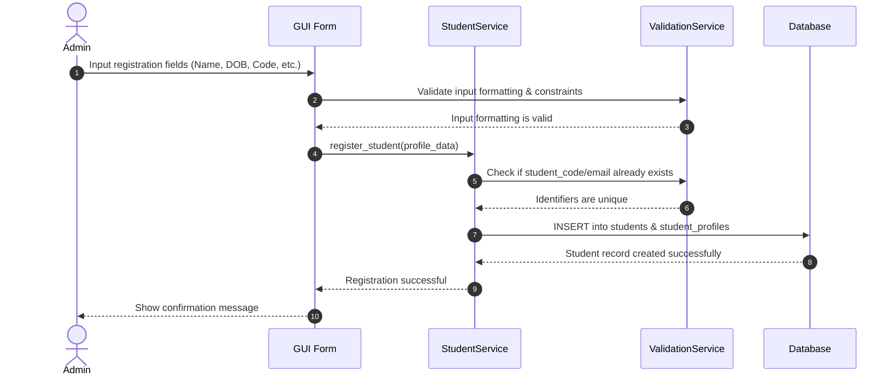
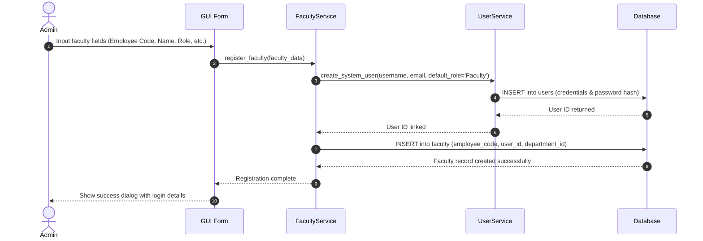
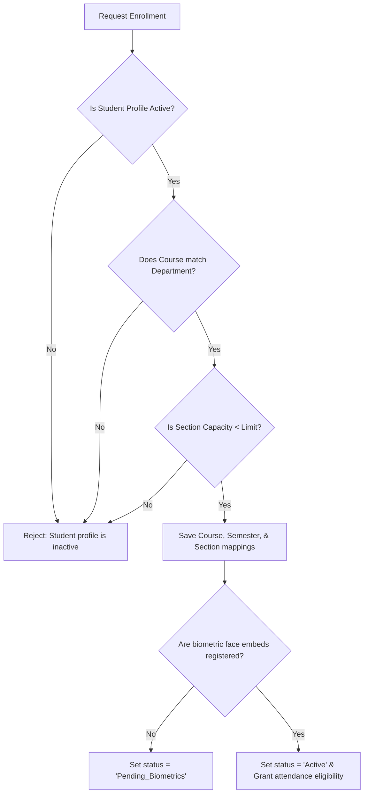
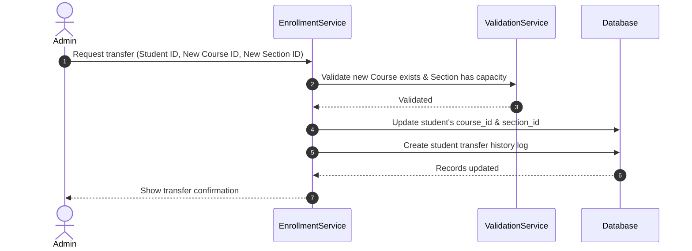
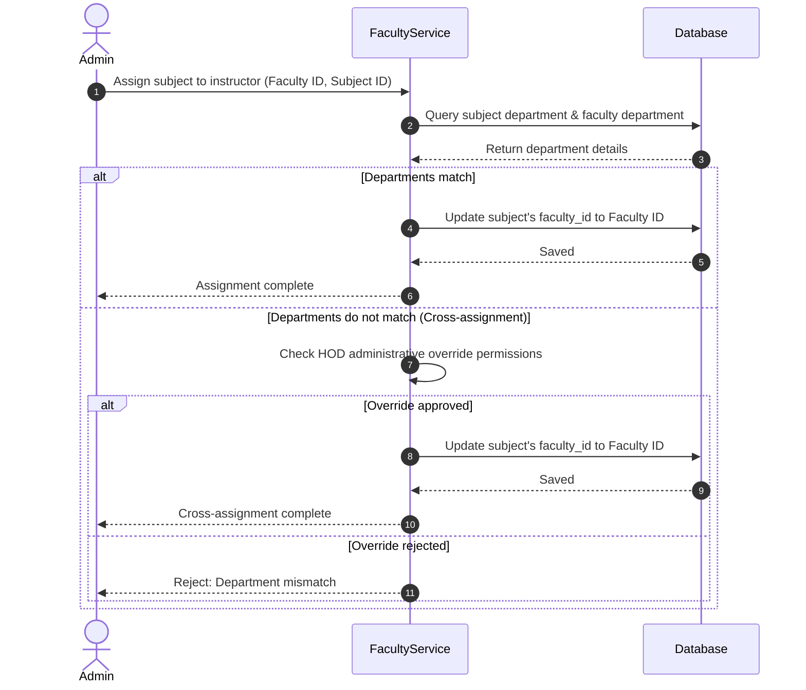
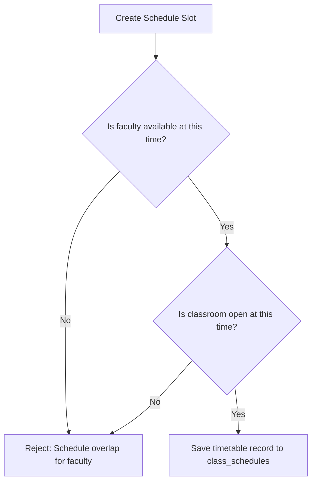
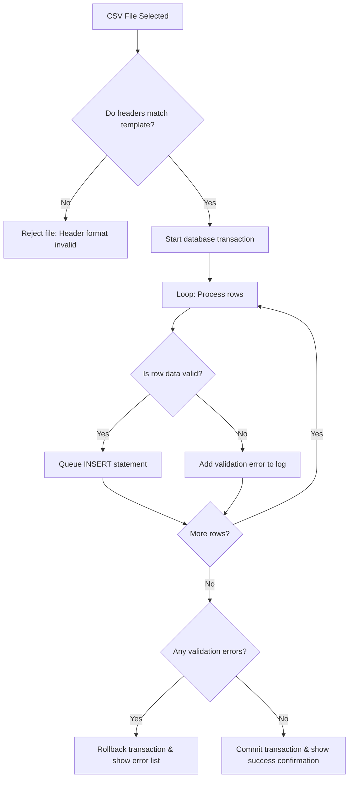
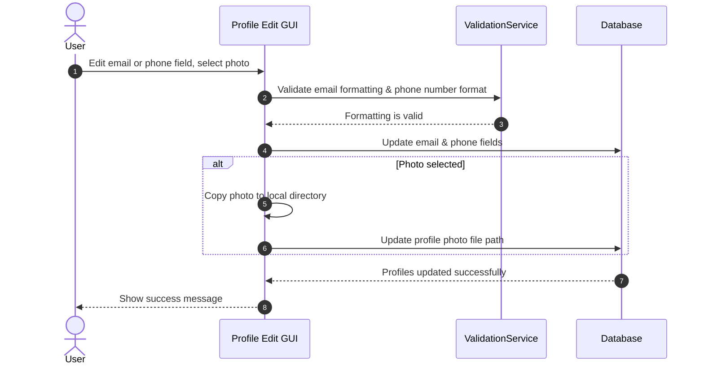

# Workflow Diagrams

## 1. Purpose
The **Workflow Diagrams** document visualizes administrative and operational workflows in the Face Recognition Attendance System. These diagrams model user actions, service layers, and database transactions to guide development.

---

## 2. Overview
The system coordinates interactions between administrators, faculty, databases, and biometric camera models. This document details these interactions for eight core administrative workflows.

---

## 3. Core Workflows (Mermaid Visualizations)

### 3.1 Student Registration Workflow
This workflow traces a student from initial data entry through profile creation, validation, and database storage.

---

### 3.2 Faculty Registration Workflow
This workflow shows the steps for onboarding a new faculty member and creating their system credentials.

---

### 3.3 Enrollment Workflow
Details how students are assigned to courses, semesters, and sections.

---

### 3.4 Student Transfer Workflow
Visualizes the process for transferring a student between courses or departments.

---

### 3.5 Faculty Assignment Workflow
Shows how faculty members are assigned to teach specific subjects.

---

### 3.6 Class Creation Workflow
Timetable scheduling. Map subjects, sections, classrooms, and instructors to time slots.

---

### 3.7 Bulk Import Workflow
Bulk file imports and transactional rollback safety logic.

---

### 3.8 Profile Update Workflow
Details how users update their profile details.

---

## 4. Business Rules
- **Rollback Consistency**: Bulk imports must use database transactions to prevent partial datasets from being saved if an error occurs.
- **Schedule Overlaps**: Schedule check validations must run immediately during input changes to prevent scheduling conflicts before submitting forms.

---

## 5. Design Decisions
- **Transaction Boundaries**: Grouping bulk import validations inside a single database transaction allows the system to roll back updates if database conflicts occur, keeping the database consistent.
- **Granular Validations**: Running validation checks at the application/service layer before database write calls provides user-friendly error messages instead of raw database constraint error codes.

---

## 6. Future Improvements
- **Live Sync Updates**: Build WebSocket integrations to push real-time updates to UI grids when background sync tasks complete.
- **Conflict Visualizer**: Add a visual conflict dashboard that displays timetable scheduling conflicts (e.g., overlapping classrooms or double-booked faculty) during timetable creation.

---

## 7. References to Related Modules
- [Management Overview](file:///c:/GitHub/Attendence-System-Uning-Face-Recognition/docs/management/Management_Overview.md)
- [Class Module](file:///c:/GitHub/Attendence-System-Uning-Face-Recognition/docs/management/Class_Module.md)
- [Import & Export](file:///c:/GitHub/Attendence-System-Uning-Face-Recognition/docs/management/Import_Export.md)
