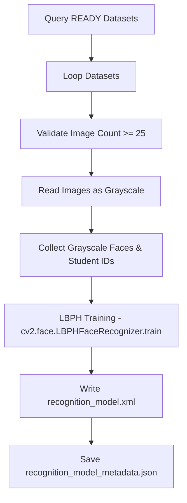

# Model Building

This document describes how the face recognition model index is compiled from validated student datasets.

## Build Process
Model training compiles all active students who possess face datasets with a `"READY"` status.

## Dataset Requirements
- **Verification Status**: Only datasets with status `"READY"` (validated in Phase 8) are processed. Datasets marked as `"NOT_REGISTERED"`, `"COLLECTING"`, `"NEEDS_UPDATE"`, or `"INVALID"` are safely skipped and reported.
- **Image Count**: A minimum of 25 validated crop images is required per student.
- **Trained IDs**: Student surrogate database keys (`student.id`) are used as labels during training to ensure a stable identifier.
