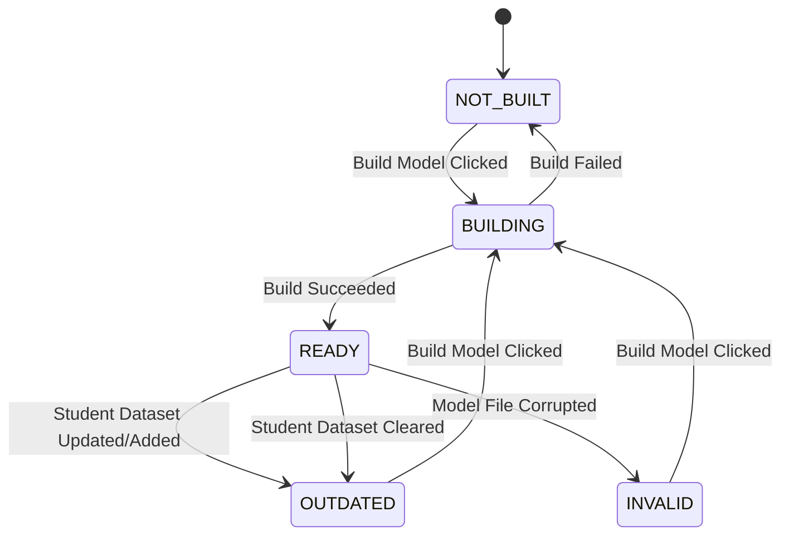

# Model Versioning & Lifecycle

This document describes model state transitions and versioning.

## Model Status States
The face recognition service evaluates model files to return one of the following states:
1. **`NOT_BUILT`**: The XML model index file does not exist on disk.
2. **`BUILDING`**: An asynchronous background model build is currently executing.
3. **`READY`**: The model is loaded, valid, and fully synchronized with the database.
4. **`OUTDATED`**: The model is valid, but newer student datasets exist or student datasets have been updated/cleared after the model was compiled.
5. **`INVALID`**: Model files exist on disk but fail to parse or are corrupted.

## Outdated Detection Rule
A model is marked `OUTDATED` if:
$$\max(\text{Dataset.updated\_at}) > \text{Model.updated\_at}$$
or if the set of database READY student IDs does not equal the model's metadata `trained_student_ids` list.

## Lifecycle Diagram

