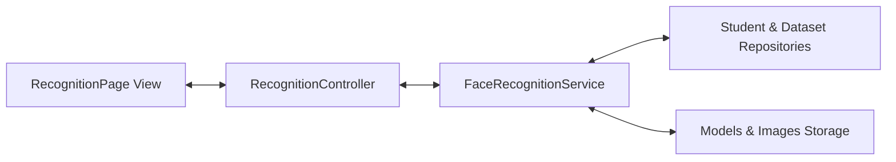

# Face Recognition Architecture

This document describes the architectural layout of the Face Recognition Engine.

## Architectural Layers
The face recognition engine is decoupled from the user interface and database using the MVC (Model-View-Controller) / Service-Repository pattern already established in the codebase.

### Components
1. **View (`RecognitionPage`)**: CustomTkinter view integrated into the `AppShell`. Renders the camera viewport frame thread (`CameraReader`) and overlay drawings.
2. **Controller (`RecognitionController`)**: Exposes presentation methods to the view. Dispatches model building to background threads to prevent UI freezes.
3. **Service (`FaceRecognitionService`)**: Encapsulates the OpenCV LBPH engine logic. Handles model loading, saving, training, preprocessing, scoring, and multi-face recognition.
4. **Repositories (`StudentRepository`, `DatasetRepository`)**: Accesses local database models for mapping student IDs and validating datasets.
