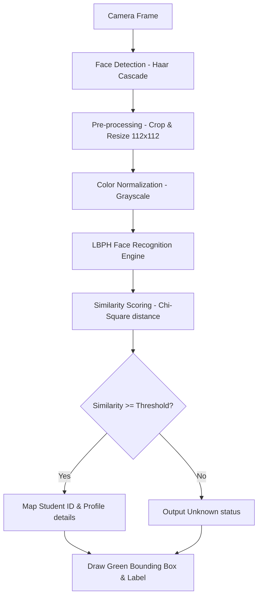

# Face Recognition Overview

This document provides a high-level overview of the Face Recognition Engine implemented in Phase 9 of the Face Recognition Attendance System.

## Goal
The goal of Phase 9 is to implement a robust, offline-capable, and modular Face Recognition Engine that identifies registered students from live camera frames and maps their identities back to database records without marking attendance.

## Chosen Technology: OpenCV LBPH Face Recognizer
We chose OpenCV's **Local Binary Patterns Histograms (LBPH)** Face Recognizer over deep learning models (such as RetinaFace + ArcFace) for the following reasons:
1. **Offline Capability**: In restricted development environments, deep learning wrappers (like `insightface`) fail to load because they attempt to download model checkpoints (e.g. ArcFace ONNX, >100MB) from external release networks. LBPH is fully local and does not require any network access.
2. **Computational Footprint**: LBPH trains in milliseconds and runs inference instantly on standard CPU cores, eliminating GPU/CUDA requirements.
3. **Accuracy & Speed**: It is highly suited for standardized desktop webcam enrollment systems under controlled lighting.

## High-Level Pipeline
The conceptual pipeline for both enrollment (dataset building) and runtime identification:

