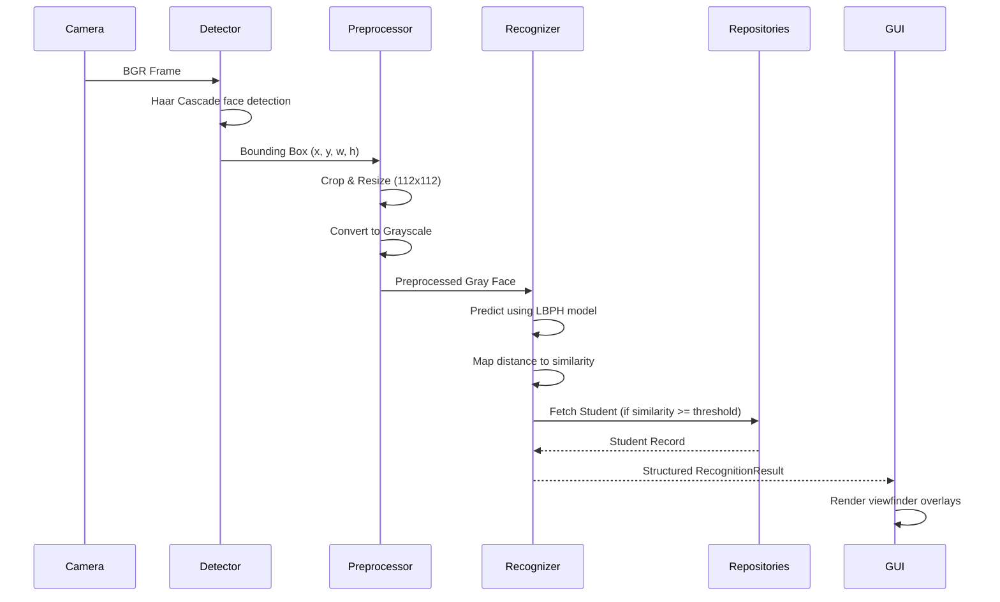

# Face Recognition Pipeline

This document details the operations performed at each stage of the recognition pipeline.

## Flow of Operations

### Modular Steps
- **Frame Grab**: Background camera reader thread updates BGR frames.
- **Detection**: Haar cascade matches face candidates.
- **Preprocessing**: Slices bounding box, resizes to 112x112, and grayscales.
- **Classification**: LBPH predicts label and similarity.
- **ID Mapping**: Database retrieves full student profile.
- **UI Drawing**: Visual bounding box, label text, and status tags are drawn.
