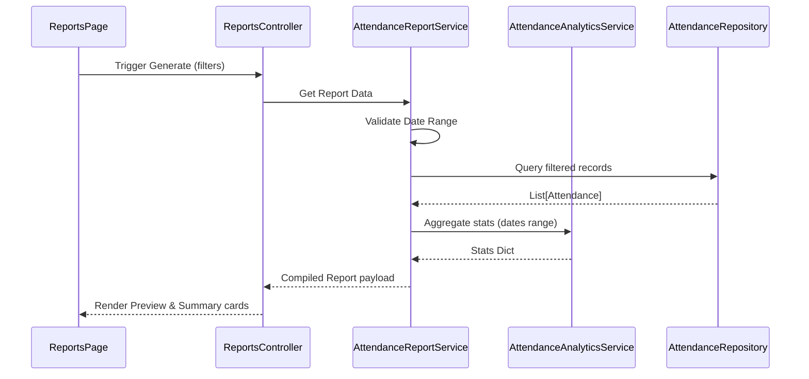

# Report Generation Pipeline

This document describes how report data is generated.

## Flow of Operations

## Preview Panel Limits
To prevent UI lockups:
- The Reports page render preview is capped at 100 rows.
- If the dataset has $>100$ records, a footer label indicates: `"Showing first 100 rows out of N. Export report to view all entries."`
