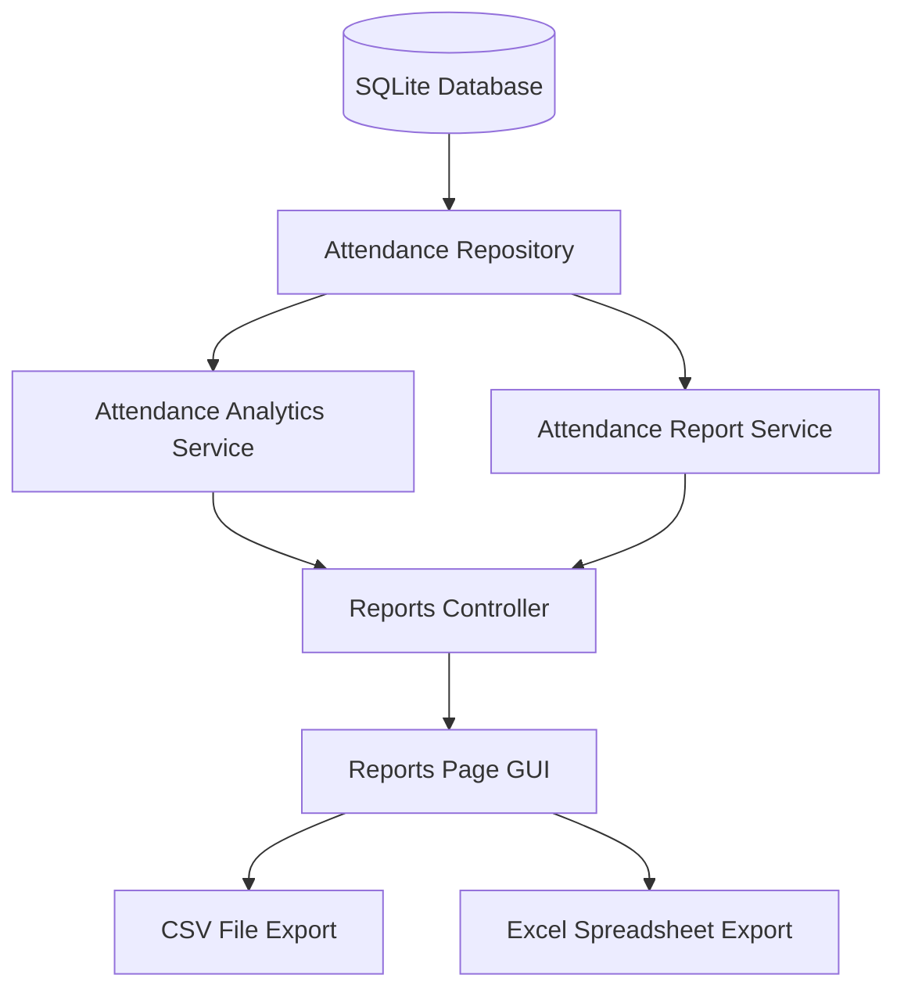

# Reports & Analytics Overview

This document provides a high-level overview of the Reports, Analytics, and Exports subsystem implemented in Phase 11.

## Goal
The goal of Phase 11 is to aggregate raw attendance logs into searchable, filterable, visual, and exportable analytics sheets. It bridges Phase 10's attendance data capture with institutional decision-making.

## High-level Diagram

## Supported Features
- **Visual Analytics Page**: Built-in CTk OptionMenus to configure presets and fetch previews.
- **Dynamic Summaries**: Real-time aggregation of attendance rates, present/late stats, and trend lines.
- **CSV & Excel Exporters**: Write filtered sheets with auto-fit widths and formatting layout directly to disk.
