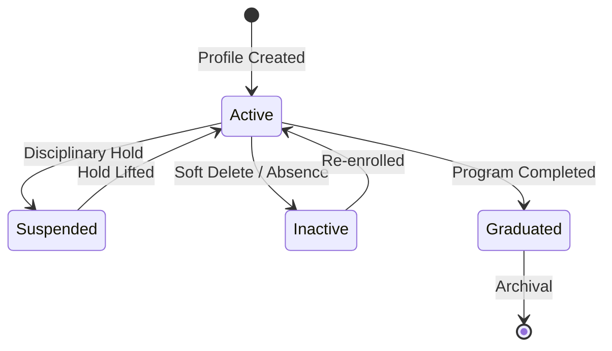

# Student Lifecycle & Navigation Workflows

This document explains the onboarding sequences, academic state transitions, and UI dialogues lifecycle workflows of the Student Management module.

---

## 1. Student State Transitions

A student record transitions through visual statuses tracked in the database:

- **Active**: Fully registered. Eligible for camera face detection matches.
- **Suspended**: Temporarily disabled. Attendance logs will mark them as unauthorized.
- **Inactive**: Muted record state. Student is excluded from search dropdown lists but remains in the database.
- **Graduated**: Read-only archival state. Marks academic completion.

---

## 2. Dialog Actions Workflow

Interaction workflows are coordinated using custom-centered blocking modals:

### 2.1 Onboarding Flow (Add Student)
1. User clicks **Add Student** in the filter panel.
2. `StudentsPage` instantiates a modal `StudentFormDialog`.
3. The dialog queries the controller to fetch seeded **Departments** and **Courses**.
4. The user fills out personal fields. Changing the Department automatically calls the controller to filter the Course option values dynamically.
5. User clicks **Save Profile**.
6. The dialog collects values, triggers `StudentController.save_student(...)`, runs service validation routines.
   - **If valid**: Commits changes to SQLite, shows success box, destroys dialog, refreshes list.
   - **If invalid**: Displays warning alert dialog, leaves inputs intact.

### 2.2 Profile View Flow
1. User clicks the **👁️ (View)** button on a student table row.
2. The page loads the student's details, querying eager relationships.
3. Instantiates `StudentDetailDialog` which partitions details in cards. Shows mock attendance logs, system metrics, and face crop placeholders.
