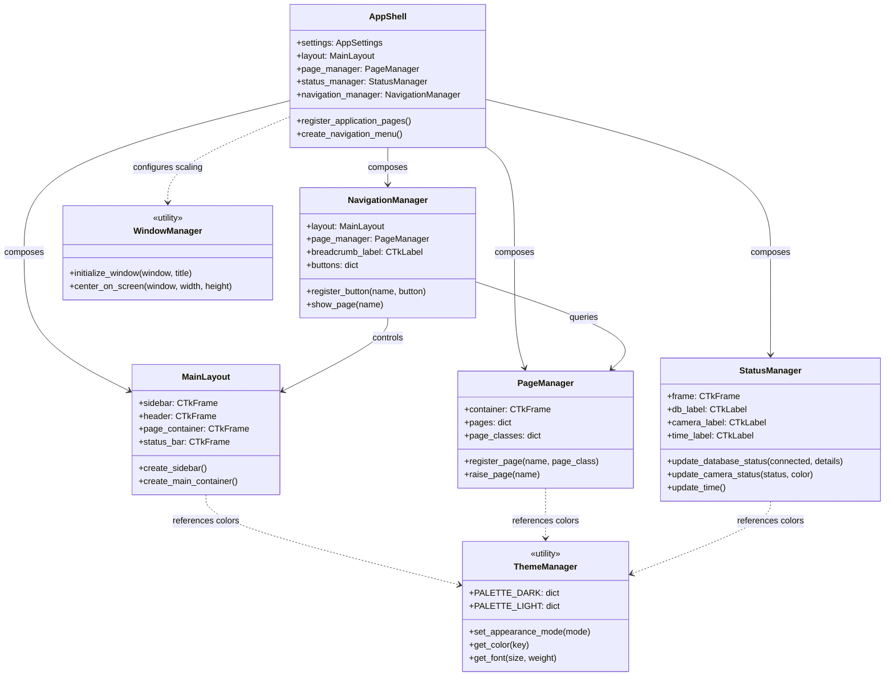
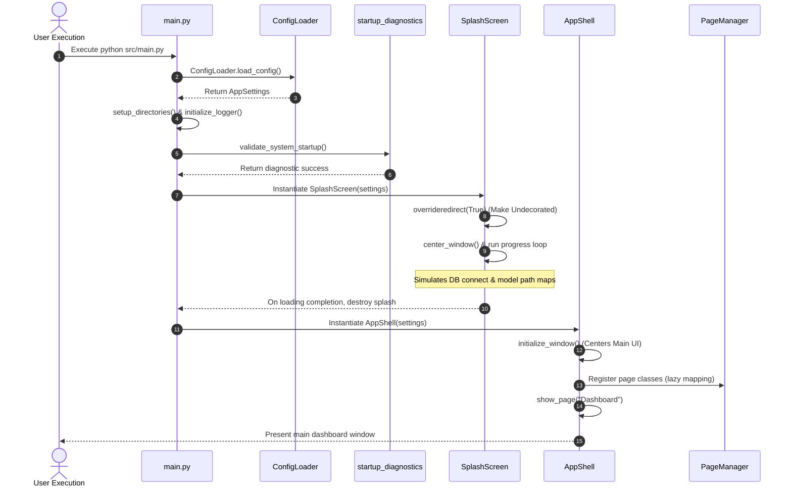

# Mermaid Architecture & Flow Diagrams

This document contains visual block diagrams, interaction sequences, and class relations for the UI framework.

---

## 1. Class Relationships & Management Composition

This diagram illustrates how `AppShell` acts as the primary coordinator, composing decoupled managers and components:

---

## 2. Bootstrapping & Transition Sequence

This diagram shows the sequence of checks and GUI initialization steps on startup:

